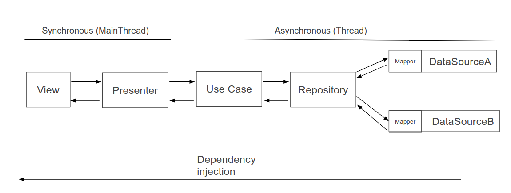

## PromoFarmaTest test code by Isaac Alvarez Gil

### Architecture

The selected architecture is Clean architecture with MVP pattern:

### Modules organization

The Module organization has two modules:

 - Api module: It contains api client with Retrofit2 configuration. It is distributed in two principal packages (client, model), and two files, the first file contains the endPoints configuration and another file to access to Retrofit2 services.
 - App module: It contains app core, it is distributed in different packages using clean architecture to distribute them. The packages are data, di, domain, presentation and kernel packages.

#### Api module

##### client
It is responsible for communicate with API and get response.

##### kernel
It Contains the core for different classes types.

##### model
It contains the models that API can understand.

#### App module 
  
##### data
It contains the whole related about data access. In this project there are three packages into data package, this packages are:

 - datasource: It contains access data classes, from data source the app access the whole data. The source data would be from the api or from local data (Shared Preferences, cache or local DB).
 - mapper: It's responsible to map data from API to Domain or from Domain to API.
 - repository: The repositories responsibility is call to different data source to get data in domain model, there may be several repositories, and they are classified by features, in this project only exist show feature.

##### di
It contains dependency injection configuration, in this project the configuration depends on Dagger2.

##### domain
In this package there are two package more:

 - model: it contains the whole domain models
 - usecase: it contains the business logic and it can communicate with the different repositories.

##### presentation
In this package exists a package for every screen. Inside those package contains the classes that manage the user interface.

 - presenter: it's responsible to know when user interact with view and decide the next step. Also it's responsible to manage the Asynchronous threads, in this case with Coroutines, and call the use cases that it needs.
 - ui: it contains the user interfaces classes, in ui package exist three different packages more that contains the classes and interfaces for the UI. This classes are activities, fragments, adapters, etc.

##### kernel
It Contains the core for different classes types. For example base configuration to presenter with Coroutines.

### Important used libraries
 - Dagger2: it's responsible to do dependency injection.
 - Coroutines: it's responsible to manage threads.
 - Glide: allow to load an image asynchronously.
 - Gson: it's responsible to map json object to our models.
 - Mockito: allow create mock objects.
 - JUnit5: to do unit tests.
 
### Annotation
There is a directory named build-configuration that contains a file with all dependencies for the app. This file exist because if some dependency is modified will affect to every module that is using this dependency. In these case we are only using one module, but in the future maybe we need another module and it's better to unified in a file.